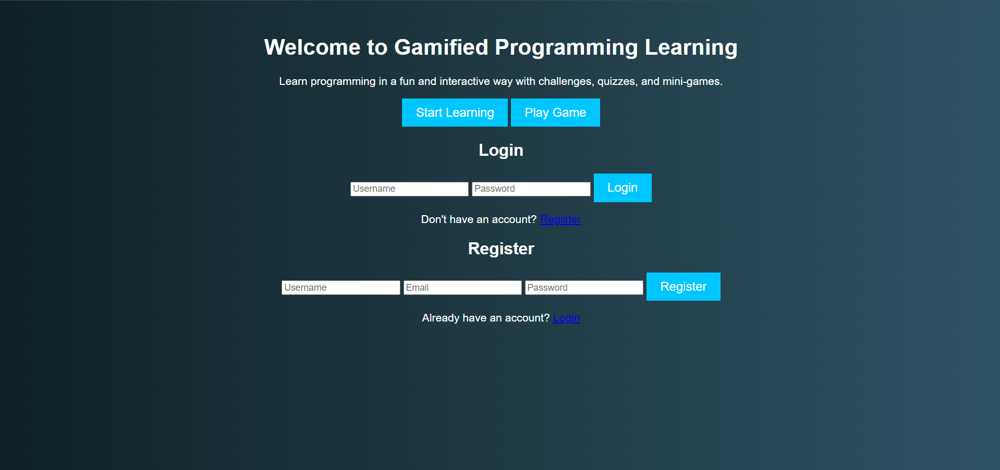

# GAMIFIED-LEARNING-PLATFORM-FOR-PROGRAMMING-MASTERY
<!DOCTYPE html>
<html lang="en">

<body>
    

        <h1>Gamified Learning Platform for Programming Mastery</h1>
        
  

            <h2>Team Information</h2>
            
<strong>Team Name:</strong> KAUSSAR_A

            
<strong>Team Members:</strong> Kiruthik Roshan K S, Kaussar A, Fiza Begum M, Jeyasri J

            
<strong>Team Leader:</strong> Kaussar A

            
<strong>Email:</strong> kaussaradammalik@gmail.com

            
  

  

            <h2>Project Overview</h2>
            
Programming is a fundamental skill in STEAM education, yet teaching it to beginners presents challenges such as lack of engagement, limited accessibility, and ineffective learning methodologies. Our solution is a gamified, interactive platform aimed at making programming enjoyable and accessible for all.

        

  

            <h2>Problem Statement</h2>
            <ul>
                <li>Traditional methods of teaching programming fail to retain students' interest.</li>
                <li>Complex programming tasks discourage beginners.</li>
                <li>Cost and scalability issues limit accessibility.</li>
            </ul>
        

  

            <h2>Proposed Solution</h2>
            
A gamified, interactive platform that integrates game-based learning into programming education.

            <ul>
                <li>Story-driven gameplay to teach coding concepts.</li>
                <li>Real-time coding challenges and multiplayer collaboration.</li>
                <li>Personalized learning paths for different skill levels.</li>
                <li>Drag-and-drop visual coding blocks transitioning to text-based programming.</li>
            </ul>
    
    
      

  

            <h2>Technical Approach</h2>
            <ul>
                <li>OpenCV (CV2)</li>
                <li>HTML, CSS</li>
                <li>Pygame (Framework)</li>
            </ul>
        

  

            <h2>How to Run</h2>
            

                git clone https://github.com/your-username/gamified-learning-platform.git 
                cd gamified-learning-platform 
                pip install -r requirements.txt 
                python main.py
            

        

  

            <h2>Future Scope</h2>
            <ul>
                <li>Expand game content to cover advanced programming concepts.</li>
                <li>Implement community-driven content creation.</li>
                <li>Add AI-based personalized learning recommendations.</li>
            </ul>
        

  

            <h2>Contributors</h2>
            <ul>
                <li>Kiruthik Roshan K S</li>
                <li>Kaussar A</li>
                <li>Fiza Begum M</li>
                <li>Jeyasri J</li>
            </ul>
        

  

            <h2>Acknowledgments</h2>
            
Special thanks to STEAM Hackathon for providing the platform to showcase our project.

        

  

            <h2>Contact</h2>
            
For any inquiries, please contact <a href="mailto:kaussaradammalik@gmail.com">Kaussar A</a>.

        

    

</body>
</html>
